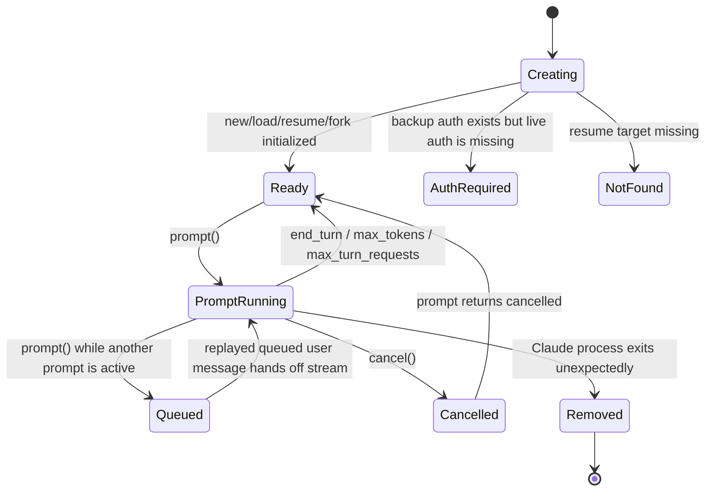

# ACP adapter for the Claude Agent SDK

[](https://www.npmjs.com/package/@ni2khanna/claude-agent-acp)

Use the [Claude Agent SDK](https://platform.claude.com/docs/en/agent-sdk/overview#branding-guidelines)
from [ACP-compatible](https://agentclientprotocol.com) clients such as
[Zed](https://zed.dev), or embed the adapter in your own ACP host.

This package exposes Claude Code as an ACP agent and adds the adapter behavior ACP clients
expect:

- prompt queueing per session
- ACP session config options for mode and model
- permission mediation for Claude tools
- invocation-specific Claude auth, memory, and settings directories
- merged MCP server, hook, tool, and disallowed-tool configuration
- prompt translation for text, resources, and images
- tool-call notifications, including terminal metadata for `Bash`

Learn more about the [Agent Client Protocol](https://agentclientprotocol.com/).

## Install

```bash
npm install -g @ni2khanna/claude-agent-acp
```

Run it as a regular ACP agent:

```bash
ANTHROPIC_API_KEY=sk-... claude-agent-acp
```

Prebuilt single-file binaries are also available on the
[Releases](https://github.com/papiguy/claude-agent-acp/releases) page for Linux, macOS, and
Windows.

## Client usage

### Zed

Recent versions of Zed can use this adapter directly from the Agent Panel. See Zed's
[External Agent](https://zed.dev/docs/ai/external-agents) documentation for setup details.

### Other ACP clients

Any ACP client that supports external agents can launch `claude-agent-acp` as its agent
command.

## Library usage

If you want the same adapter behavior inside your own process, use the exported library entry
points instead of shelling out to the CLI:

```ts
import { AgentSideConnection, ndJsonStream } from "@agentclientprotocol/sdk";
import { ClaudeAcpAgent, nodeToWebReadable, nodeToWebWritable } from "@ni2khanna/claude-agent-acp";

const stream = ndJsonStream(nodeToWebWritable(process.stdout), nodeToWebReadable(process.stdin));

new AgentSideConnection(
  (client) =>
    new ClaudeAcpAgent(client, {
      defaultTools: ["Bash", "Read", "Glob", "Grep", "WebSearch", "WebFetch"],
    }),
  stream,
);
```

If you just want the default stdin/stdout transport, call `runAcp()` instead.

## Session metadata and settings

The adapter accepts a few ACP `_meta` extensions when a session is created:

- `_meta.systemPrompt`: replaces or appends to the default `claude_code` system prompt
- `_meta.disableBuiltInTools`: legacy shorthand for `tools: []`
- `_meta.claudeCode.configDir`: stores Claude state in `<configDir>/.claude` and auth files in
  `<configDir>`
- `_meta.claudeCode.options`: forwards Claude SDK options, with ACP-owned fields overridden

`_meta.claudeCode.options` is merged with adapter behavior:

- `hooks`, `mcpServers`, and `disallowedTools` are merged
- `tools` is passed through as-is and defaults to the `claude_code` preset
- `cwd`, `includePartialMessages`, `permissionMode`, `canUseTool`,
  `allowDangerouslySkipPermissions`, and the Claude executable path stay under ACP control

Settings are resolved with this precedence:

1. user settings
2. project settings
3. local project settings
4. enterprise managed settings

With a custom `configDir`, the adapter uses `<configDir>/.claude/settings.json` as the user layer,
`<configDir>/.claude/settings.local.json` as the local layer, and skips the project layer under
`<cwd>/.claude`.

## Session lifecycle

The adapter keeps a small in-memory state machine per ACP session and uses prompt replay to hand
off queued prompts:



More detail, including queue-handoff and terminal notification diagrams, lives in
[docs/ARCHITECTURE.md](./docs/ARCHITECTURE.md).

## Documentation

- [Library Guide](./docs/LIBRARY.md)
- [Architecture and State Machine](./docs/ARCHITECTURE.md)
- [Release Process](./docs/RELEASES.md)

## License

Apache-2.0
