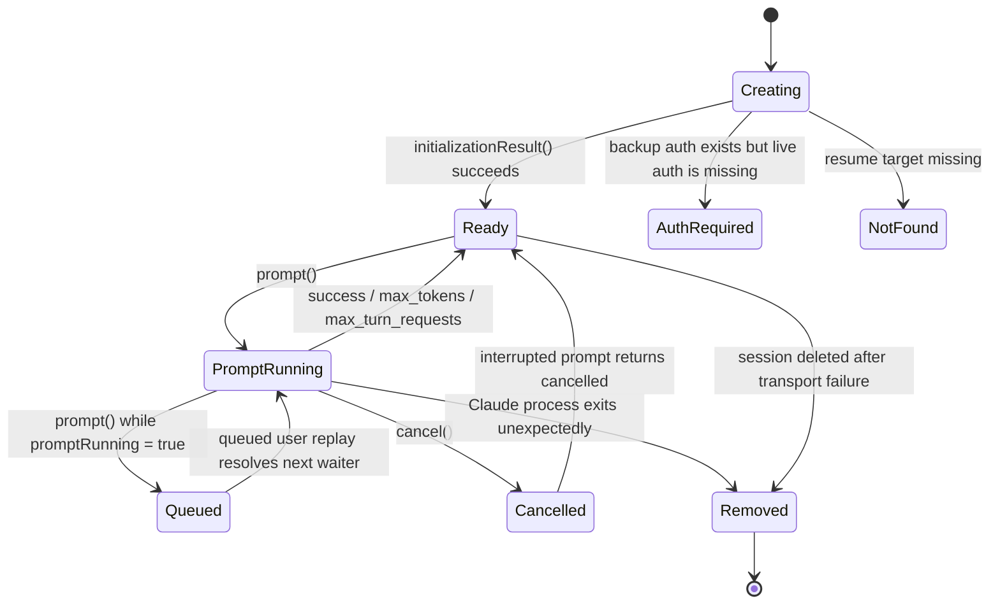
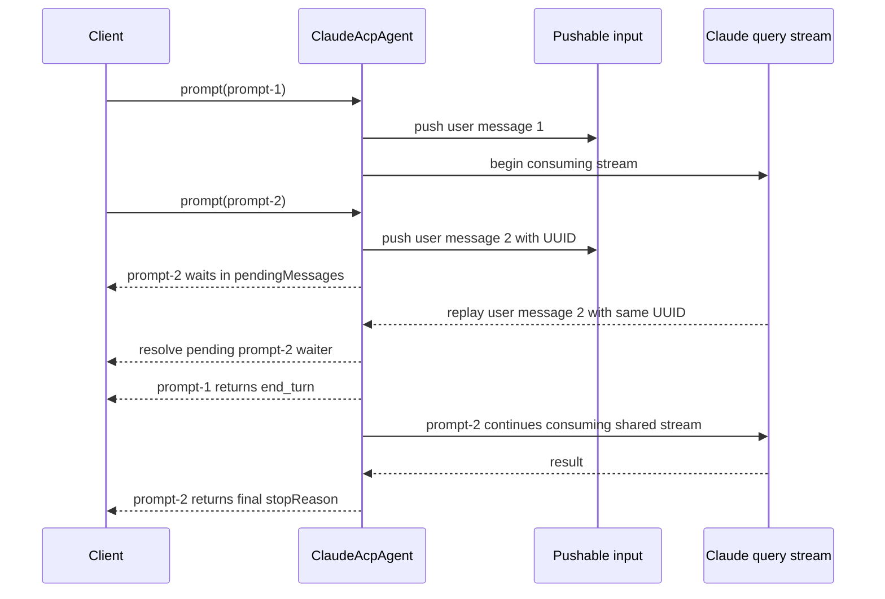
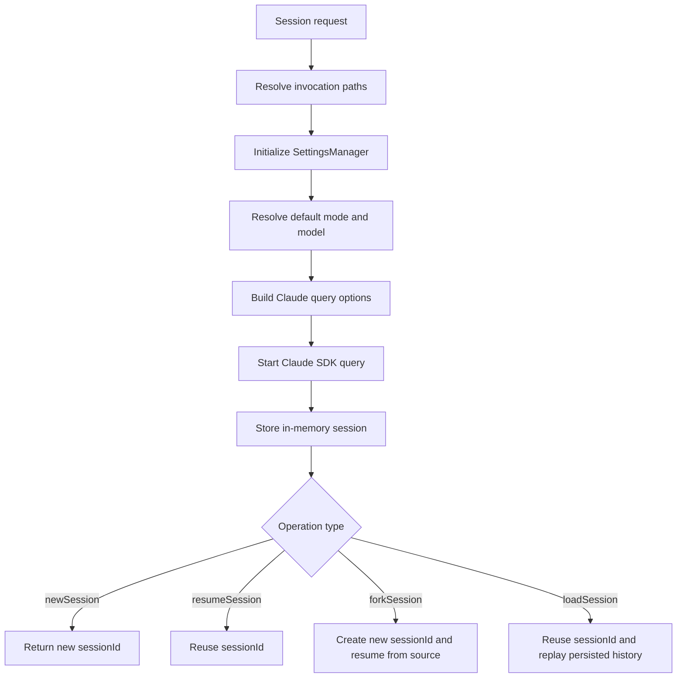
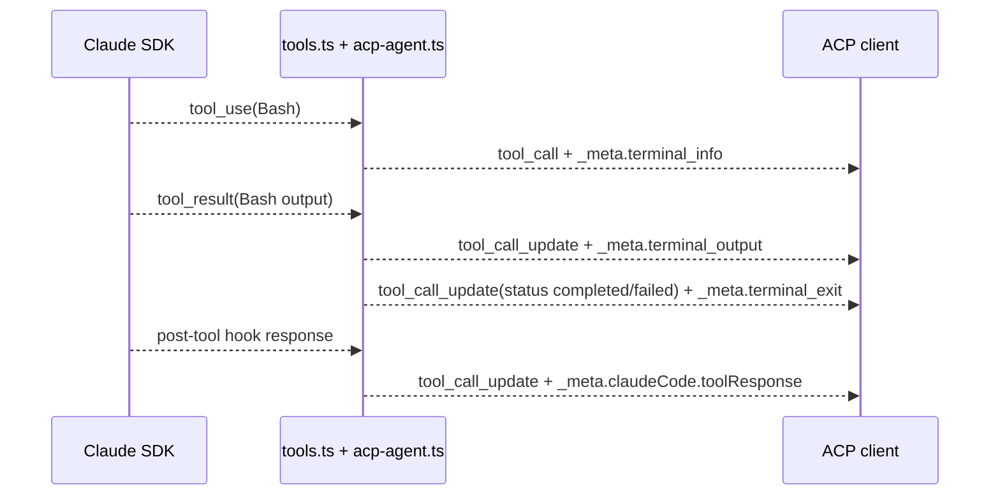
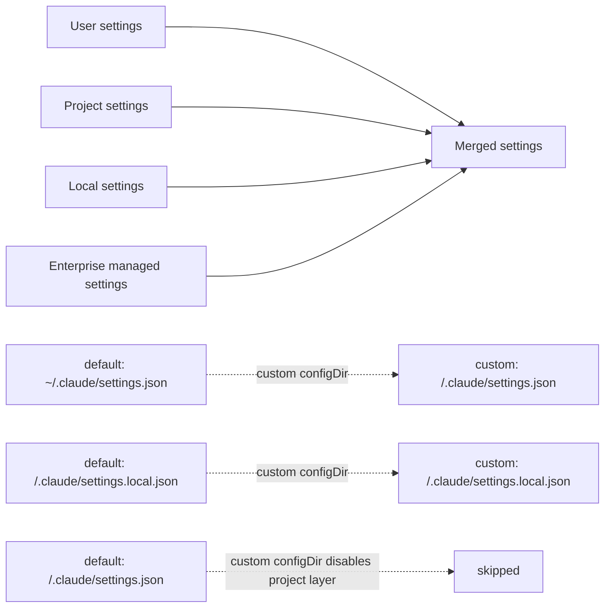

# Architecture and State Machine

This document describes the adapter as it behaves today. The diagrams below are based on the
implementation in `src/acp-agent.ts`, `src/tools.ts`, `src/settings.ts`, and `src/claude-config.ts`.

## Main components

- `src/index.ts`: CLI bootstrap, managed-settings env injection, and stdout/stderr setup
- `src/acp-agent.ts`: ACP `Agent` implementation, session lifecycle, auth, prompt queueing, and
  Claude SDK integration
- `src/tools.ts`: tool-call formatting and Claude-to-ACP notification conversion
- `src/settings.ts`: merged Claude settings plus file watching
- `src/claude-config.ts`: invocation-directory and Claude-state path helpers

## Session state machine

Each ACP session has a small in-memory state object plus one Claude SDK query stream.



Important behavior behind that diagram:

- queued prompts are pushed into the same input stream immediately, then blocked on a UUID-based
  handoff
- the currently running `prompt()` call returns `end_turn` as soon as Claude replays the queued
  user message, so the next `prompt()` call can continue consuming the shared stream
- cancellation is per in-flight prompt, not sticky session state; each new `prompt()` resets
  `cancelled` to `false`

## Prompt queue handoff

The queueing behavior is the least obvious part of the adapter.



The adapter also has a safety valve: if the expected replay never arrives, the `finally` block
force-resolves the next queued waiter so prompts do not deadlock.

## Session creation and replay flow

`newSession`, `loadSession`, `resume`, and fork all pass through the same `createSession()` path.
They differ in how the session ID is chosen and whether history replay runs afterward.



Notable details:

- `loadSession()` replays persisted messages with a fresh tool-use cache and hook registration
  disabled, so replay does not re-run post-tool hooks
- if a resume target does not exist and the Claude SDK closes during initialization, the adapter
  converts that to ACP `resourceNotFound`

## Tool and terminal notification flow

The adapter does not maintain a separate terminal state machine. Instead, terminal behavior is
encoded in Bash tool notifications.



Other tool-mapping rules:

- `TodoWrite` becomes ACP `plan` entries instead of a regular tool-call stream
- repeated appearances of the same tool use are converted into `tool_call_update` instead of a
  duplicate `tool_call`
- parent tool IDs are preserved in `_meta.claudeCode.parentToolUseId` when Claude emits nested
  sub-agent activity

## Settings resolution

Claude settings come from multiple layers, and invocation-specific sessions intentionally change
where those layers live.



Merged fields currently used by the adapter:

- `permissions.defaultMode`
- `model`
- `env`

Enterprise-managed settings have the highest precedence in the merged view.

## Mode transitions

Permission mode can change from settings, explicit ACP calls, or the adapter's post-tool hook.

```mermaid
stateDiagram-v2
    [*] --> default
    [*] --> acceptEdits
    [*] --> plan
    [*] --> dontAsk
    [*] --> bypassPermissions

    default --> plan: post-tool hook enters plan mode
    acceptEdits --> plan: post-tool hook enters plan mode
    plan --> default: ExitPlanMode approved once
    plan --> acceptEdits: ExitPlanMode approved always
    default --> acceptEdits: setSessionMode / config option
    default --> dontAsk: setSessionMode / config option
    default --> bypassPermissions: setSessionMode / config option
```

`bypassPermissions` is only exposed when the process is not running as root, unless the runtime has
explicit sandbox allowance.
